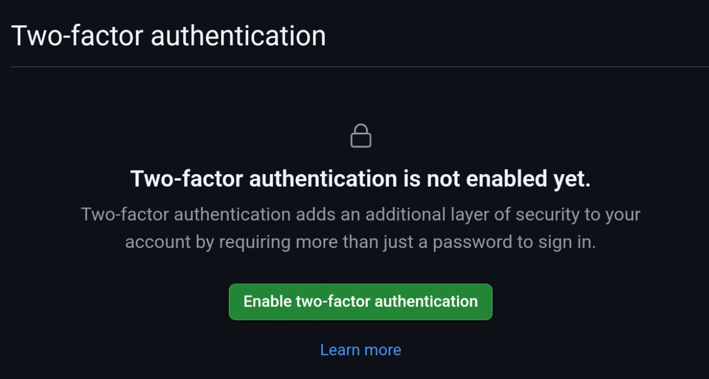
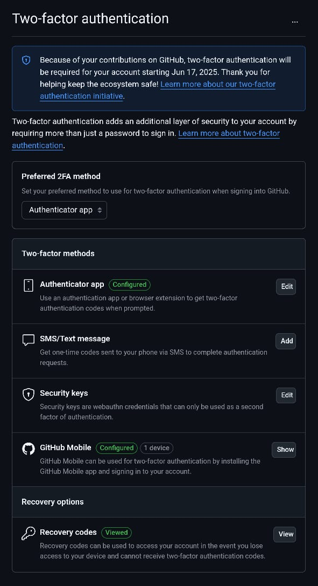
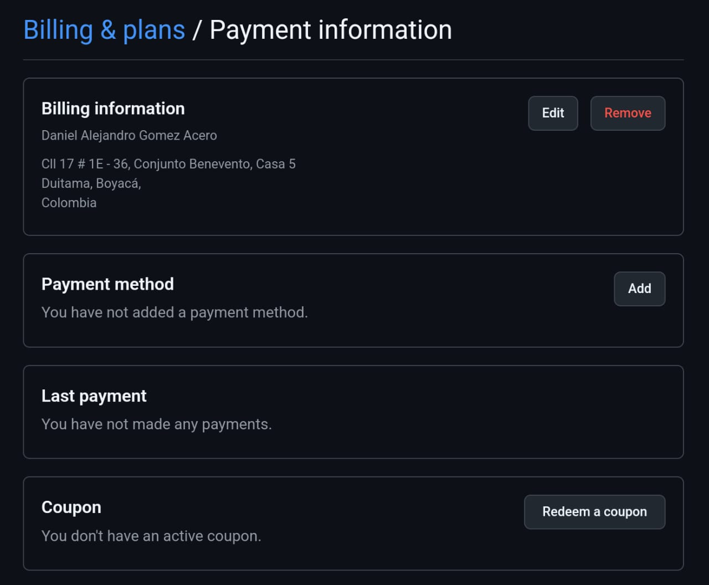
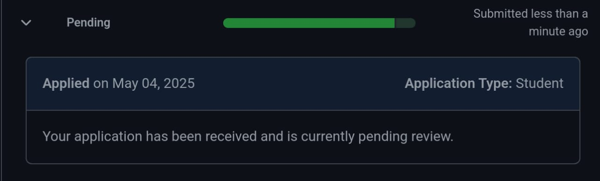
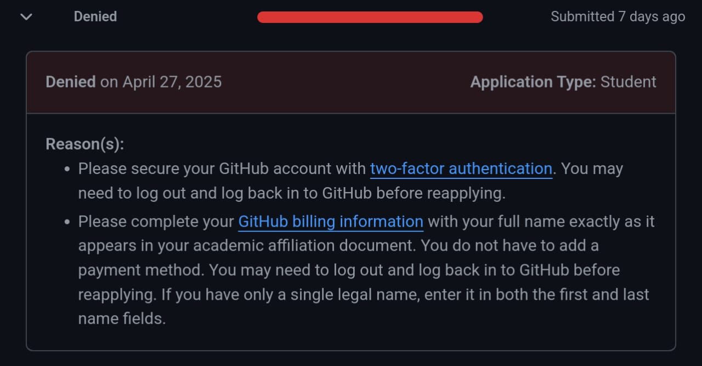
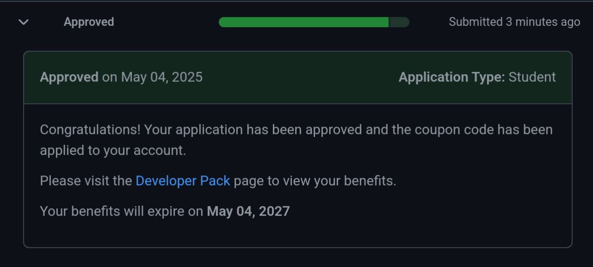
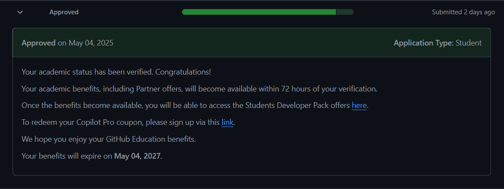

# Acceso a beneficios de GitHub Education para participantes del Bootcamp GitHub - Código Facilito

> ⚠️ **Disclaimer**  
> Este documento incluye capturas de pantalla en inglés, dado que GitHub ha dejado de ofrecer interfaces localizadas y todo su contenido se encuentra actualmente en dicho idioma.

---

## Tabla de contenido

- [¿Por qué es importante este proceso?](#por-qu%C3%A9-es-importante-este-proceso)
- [1. ¿Qué es GitHub Education?](#1-qu%C3%A9-es-github-education)
- [2. Requisitos previos](#2-requisitos-previos)
- [3. Asociar y verificar un correo institucional](#3-asociar-y-verificar-un-correo-institucional)
- [4. Activar la autenticación en dos pasos (2FA)](#4-activar-la-autenticaci%C3%B3n-en-dos-pasos-2fa)
- [5. Diligenciar información de facturación](#5-diligenciar-informaci%C3%B3n-de-facturaci%C3%B3n)
- [6. Aplicar a GitHub Education](#6-aplicar-a-github-education)
- [7. Estados del proceso de aplicación](#7-estados-del-proceso-de-aplicaci%C3%B3n)
- [8. Acceso a beneficios tras la aprobación](#8-acceso-a-beneficios-tras-la-aprobaci%C3%B3n)

---

## ¿Por qué es importante este proceso?

Dentro del programa de certificación de GitHub Foundation y Código Facilito, se entregarán **200 vouchers** para presentar el examen de certificación, seleccionados por filtros definidos por la organización. Sin embargo, existen **otros beneficios alternativos** para quienes **posean un correo institucional terminado en `.edu`**, a través de la plataforma **GitHub Education**.

Este proceso permite **acceder gratuitamente al examen** sin depender de los 200 cupos sorteados, y sin necesidad de asumir el costo de USD $49 (puede variar por región), siempre que cumplas con los requisitos de validación que GitHub establece.

---

## 1. ¿Qué es GitHub Education?

GitHub ofrece beneficios exclusivos a estudiantes, docentes y miembros de instituciones educativas que posean un correo institucional. Estos beneficios incluyen licencias, herramientas de desarrollo y, en algunos casos, acceso gratuito a exámenes o certificaciones.

Puedes consultar el listado completo de beneficios en su sitio oficial:  
[https://github.com/education](https://github.com/education)

---

## 2. Requisitos previos

Antes de aplicar a GitHub Education, debes cumplir con los siguientes requisitos:

- Tener un correo electrónico institucional asociado y verificado en tu cuenta de GitHub
- Tener habilitada la autenticación en dos pasos (2FA).
- Diligenciar tu información de facturación (sin necesidad de añadir métodos de pago).

---

## 3. Asociar y verificar un correo institucional

1. Ve a [https://github.com/settings/emails](https://github.com/settings/emails)
2. En la sección **Add email address**, agrega tu correo institucional.
3. Accede a tu bandeja de entrada del correo institucional. Busca el mensaje de verificación enviado por GitHub. Este puede estar en la carpeta de **Spam**, **Social**, **Promociones** u **otra**, según el proveedor de correo.

---

## 4. Activar la autenticación en dos pasos (2FA)

1. Ve a [https://github.com/settings/security](https://github.com/settings/security).
2. Desplázate hasta el encabezado **Two-Factor Authentication**.
3. Haz clic en **Enable Two-Factor Authentication**. Así se verá esta sección **antes de activarla**:

   

### Proceso de activación (3 pasos):

- **Paso 1**: Escanea el código QR con una app de autenticación (por ejemplo: Google Authenticator, Authy o la extensión recomendada por GitHub).
- **Paso 2**: Guarda tus códigos de recuperación. GitHub **no almacena** esta información.
- **Paso 3**: Confirmación. Tras completar el proceso, verás una interfaz como la siguiente:

   

**¿Qué son?**
- [PassKeys](https://passkeys.dev/): Método moderno de autenticación sin contraseñas. 
- [Security Keys](https://www.yubico.com/): Llaves físicas como las **YubiKeys**, para mayor seguridad. 
- GitHub Mobile: Aplicación oficial.

---

## 5. Diligenciar información de facturación

1. Accede a [https://github.com/settings/billing/payment_information](https://github.com/settings/billing/payment_information).
2. Completa el formulario de **Billing Information** con tu nombre completo (como figura en tu documento académico). Una vez completado, verás una vista como la siguiente:

   

3. **NO ES OBLIGATORIO** completar la sección **Payment Methods**.

---

## 6. Aplicar a GitHub Education

1. Dirígete a [https://github.com/settings/education/benefits](https://github.com/settings/education/benefits).
2. Haz clic en **Start an application**.
3. Completa el formulario con:
   - Institución educativa
   - Rol (estudiante, docente, etc.)
   - Comparte tu ubicación (botón **Share Location**)

4. GitHub solicitará evidencia de tu afiliación. Para ello, deberás subir un documento que respalde tu vínculo con la institución. Estos están catalogados de la siguiente manera:

### Niveles de validez

| Nivel   | Descripción                   | Ejemplos aceptados                                          |
|---------|-------------------------------|-------------------------------------------------------------|
| GOOD    | Alta probabilidad de aprobación | Documento de identificación oficial                         |
| FAIR    | Probabilidad media             | Certificado de notas vigente, carta de inscripción con membrete |
| POOR    | Baja probabilidad              | Horario de clases, programa de asignatura, recibo de pago, carta de beca, captura de portal escolar |

---

## 7. Estados del proceso de aplicación

Una vez enviada la solicitud, puede pasar por los siguientes estados:

### 1. Pendiente

Estado inicial tras enviar la solicitud. Indica que está en proceso de revisión.  

   

### 2. Denegado

Indica que la solicitud fue rechazada. Se incluye el motivo del rechazo.  

**Ejemplo personal:** En mi caso, la primera aplicación fue rechazada por no tener habilitado el 2FA ni completar la información de facturación.  

   

### 3. Aprobado

Indica que la aplicación fue aceptada. Se mostrará la fecha hasta la cual podrás disfrutar de los beneficios.

  

Entre 24 y 48 horas después de la aprobación, tendrás acceso a una vista más detallada de los recursos disponibles.

  

---

## 8. Acceso a beneficios tras la aprobación

Una vez aprobada la solicitud, GitHub invita a explorar todos los beneficios disponibles a través de su plataforma:  
[https://education.github.com/pack](https://education.github.com/pack)

---
